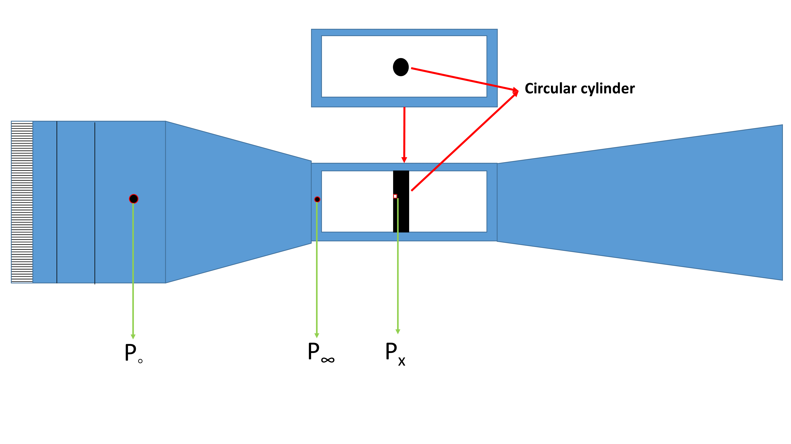

  

# Procedure

  

## Required Apparatus

### Windtunnel

  

##### Fig.1 - Windtunnel with Settling chamber, Honeycomb and Entrance highlited

 

##### Fig.2 - Windtunnel with Diffuser, Test-section, VFD and Contraction cone highlighted.

 

An open return low subsonic suction-type atmospheric wind tunnel generates the flow in which the model will be mounted. Wind tunnel components are a honeycomb section, a settling chamber, a contraction cone, a test section, a diffuser, a suction fan, and a motor. The air from the atmosphere enters the tunnel through the honeycomb section. Honeycomb reduces the turbulence from the atmosphere by breaking down the disturbances and stretching the flow due to its structure. The flow then goes through the settling chamber, which has two wire meshes, further reducing incoming turbulence. The settling chamber has a large volume which further dissipates any disturbances. The contraction cone increases the velocity by reducing area at the expense of pressure. There are two pressure tappings in the wind tunnel; one at the settling chamber, which gives stagnation or total pressure, and the second at the end of the contraction cone, which gives static pressure. The difference in these two pressure is used to calculate the inlet velocity of the test section. The test section is a constant cross-section area where we achieve a one-dimensional, steady, and uniform flow. Models are mounted in this part for the test. Diffuser has two functions: one, it reduces the velocity and increases the pressure leading to the suction fan, which results in less work required by the fan; and two, it provides a gradual decrease in velocity or increase in pressure after the test section, which prevents any flow separation and backflow. The suction fan creates the necessary pressure difference required to maintain the airflow. The fan is run by the motor, which can run at different rpm to create a range of velocity. The rpm of the motor is controlled by a variable frequency drive (VFD). 

  

### Circular cylinder

  

##### Fig.3 - Cylindrical model used in the experiment.

  

A circular cylinder of diameter 30mm is used as the model for this experiment. The cylinder consists of one pressure port. It is placed in the test section and can be rotated at any required angle. The pressure port is connected to the pressure transducer, and the model is rotated to get values at different angles.

  

### Electronic pressure measurement instrument

  

##### Fig.4 - DSA 3217 alongwith the schematic of the operation.

  

An electronic pressure measurement instrument is used to measure pressure coming from the cylinder model. Here we have used a Scanivalve-made digital sensor array (DSA 3217) which is a differential pressure measurement device; it has 16 temperature-compensated piezoresistive sensors with a pneumatic calibration valve, RAM, 16-bit A/D converter, and a microprocessor in a compact, self-contained module. It outputs pressure values in the user-defined engineering unit directly. We can measure 16 pressures simultaneously using this device. It uses an Ethernet connection for communication with any computer.

### Data acquisition system

To operate DSA, a manufacturer-provided software DSALink is required. The software is run using a computer, where a user defines the necessary parameters like data rate, number of samples, and engineering unit. DSA is connected to a computer via ethernet using TCP/IP protocol.
  
  

## Experimental procedure

  

### Schematic of the setup:

##### Fig.5 - Schematic of the present experiment.

  

#### Steps

1. Take dimensions of circular cylinder.

2. Fix the circular cylinder in the wind tunnel with pressure port at ***180o*** i.e. leading edge facing the flow.

3. Connect the reference port of the DSA3217 to the pressure port at the inlet of test section.

4. Connect a port on DSA3217 with the circular cylinder using pneumatic tube. The reading at the connected port is now (***P&Theta; - P&#x221E;***).

5. Connect a port on DSA3217 with the pressure port at the settling chamber using pneumatic tube. The reading at the connected port is now    (***P0 - P&#x221E;***).

6. Zero calibrate the transducer, i.e., check the output is zero in no flow condition.

7. Set a desired velocity in the wind tunnel using VFD.

8.	Take the pressure measurements at different anlges by rotating cylinder at sample interval until  ***360o***. In this experiment, we considered at an interval of ***18o***.

9.	The experiment can be repeated for different velocity to get readings for different Reynolds number.

10.	Tabulate all the data and calculate ***Cp*** and  ***CD*** using the equations.

    #### Calculations

    - From eq. (3) determine the experimental Coefficient of pressure, may call it as experimental value

    - From eq. (4),determine the theoretical Coefficient of pressure.

    - From eq. (5),determine the drag Coefficient.

11. Plot graph for theoretical  and experimental Coefficient of pressure.

