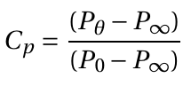
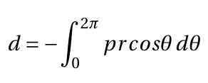

# Theory:

## Introduction to experiment

<figcaption align = "center"><b>Fig.1 - Basic features of the flow past cylinder. (adapted from : Davenport, W.J. (2003))</b></figcaption>

Flow over a cylinder is a fundamental aerodynamics problem of practical importance. The flow field over the cylinder is symmetric at low values of the Reynolds number. As the Reynolds number increases, flow begins to separate behind the cylinder, causing vortex shedding, an unsteady phenomenon. In this experiment, a wind tunnel test  is conducted using conventional instrumentation, specifically a static pressure port. Many models present themselves to flow as cylinders of different cross sections. The flow pattern and the drag on a cylinder are functions of the Reynolds number , based on the cylinder diameter $d$ and the undisturbed free-stream velocity U∞. The drag is usually expressed as a coefficient , where D is the drag force per unit span. Cylinder exhibit varying flow patterns at different Reynolds numbers. The flow pattern at high Reynolds numbers () is sketched in Figures 1(a) and 1(b). When flow hits the cylinder, a stagnation point is formed at the leading edge, and the pressure at this point equals the stagnation pressure. The pressure coefficient there is, therefore, equal to 1 using the equation  (see Figure 2 from Bertin and Smith, 1989). 

<figcaption align = "center"><b>Fig.2 - Measured pressure ditributions on a circular cylinder with a theoretical distribution calculated assuming ideal flow. Angle theta defined in Figure 1   (adapted from : Bertin and Smith(1989))</b></figcaption>

After the leading edge, the flow accelerates on both sides, producing a pressure drop (Figure 2). Immediately adjacent to the cylinder surface, a thin boundary layer is formed.

For ReD less than 400,000, the boundary layer remains laminar between the stagnation and flow separation points. The resulting flow pattern (Figure 1(a)) is termed sub-critical. The laminar boundary layer separates upstream of the maximum thickness (see Figure 1(a)). Separation occurs because the boundary layer anticipates the deceleration of the flow (and, therefore, a positive pressure gradient). The flow quickly becomes turbulent downstream of separation, and a broad wake is formed. The wake is unstable and rolls up into vortices shed anti-symmetrically at regular intervals from the cylinder (Figure 1(a)). The wake is called a von Kármán vortex street. Because of separation, the pressure remains low and approximately constant over the rearward face of the cylinder. A net imbalance of pressure forces on the cylinder (Figure 2) is caused, usually referred to as the pressure drag. Pressure drag accounts for about 90% of this regime's total drag on the cylinder. The remaining 10% is due to skin-friction drag - friction between the flow and the cylinder. Most skin-friction drag is produced on the forward face of the cylinder where the boundary layer is thin, and velocity gradients at the cylinder surface are large.

For Reynolds numbers greater than 400,000, the boundary layer becomes turbulent on the forward face of the cylinder. The resulting flow pattern (Figure 1(b)), termed super-critical, is associated with a much lower drag, and Cd is approximately 0.3. This drop in Cd is usually referred to as the drag crisis. The flow remains attached to the cylinder surface well past its maximum thickness. As a result, the wake is much narrower, the imbalance of pressure forces on the cylinder surface is much smaller, and the pressure drag is greatly reduced. This reduction swamps a small increase in skin-friction drag produced by the greater length of the boundary layer and its transition. The drag crisis need not always occur at ReD = 400,000, and roughness of the cylinder surface or unsteadiness in the free stream can cause boundary layer transition at a much lower Reynolds number.

Plots of pressure distribution and pressure coefficients along the surface of the cylinder demonstrate the flow separation.

## Mathematical Description:

I. By definition of Coefficient of pressure,

 &nbsp; &nbsp; &nbsp; &nbsp; &nbsp; &nbsp; &nbsp; &nbsp; (1)

From Bernoulli's equation,

 &nbsp; &nbsp; &nbsp; &nbsp; &nbsp; &nbsp; &nbsp; &nbsp; (2)

From eq. 1 and 2 

 &nbsp; &nbsp; &nbsp; &nbsp; &nbsp; &nbsp; &nbsp; &nbsp; (3)

II. From potential flow theory,

 &nbsp; &nbsp; &nbsp; &nbsp; &nbsp; &nbsp; &nbsp; &nbsp; (4)

Where,

P    - Presure

Cp  - Coefficient of presure

V    - Velocity

ρ - Density of fluid

θ  - Angle between oncoming flow directiona and port location.

Subscript

θ  - measurement port.

0       - Total, measured at settling chamber.   

∞  - Freestream, measured at inlet of test section. 

## Determining the pressure drag from surface-pressure measurements

The drag on a real cylinder is, of course, not zero and can be estimated from a measured pressure distribution as follows. Consider an element of the cylinder surface of length ds = rdθ as shown in Figure. The force per unit span on the element due to a pressure normal to the element is

The drag component of this force is the component acting in the direction of the free-stream velocity

The integral of this around the cylinder circumference gives the total drag on the cylinder per unit span d.

Now, it is conventional to work in terms of the non-dimensional drag coefficient and pressure coefficient, respectively:

 

where d is the cylinder diameter. We therefore have,

Or

the second integral is zero, giving,

This integration can be done numerically using Simpson's or the trapezium rule or by plotting Cpcosθ vs. θ and measuring the area under the curve. θ is measured in radians.

The above estimate of CD takes account only of the pressure drag on the cylinder. In calculating this, however, it is fairly accurate, the main source of error probably being the numerical integration.
